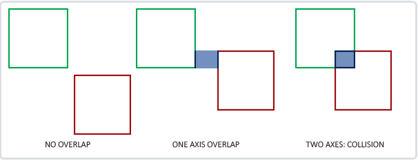
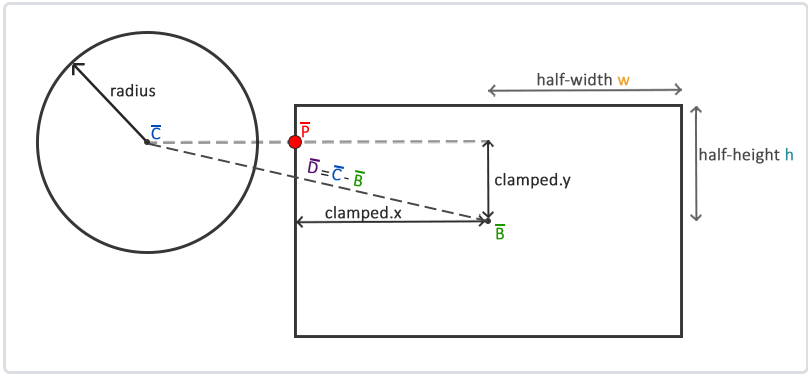
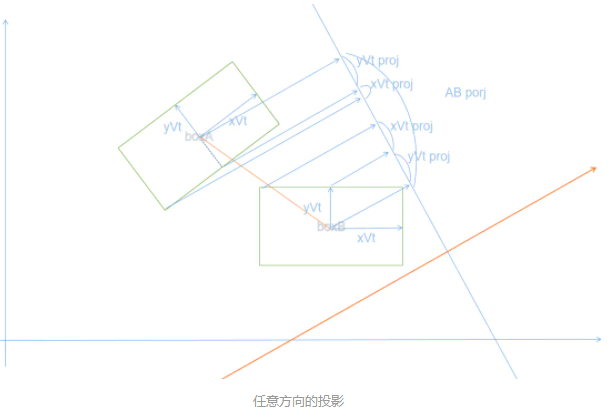
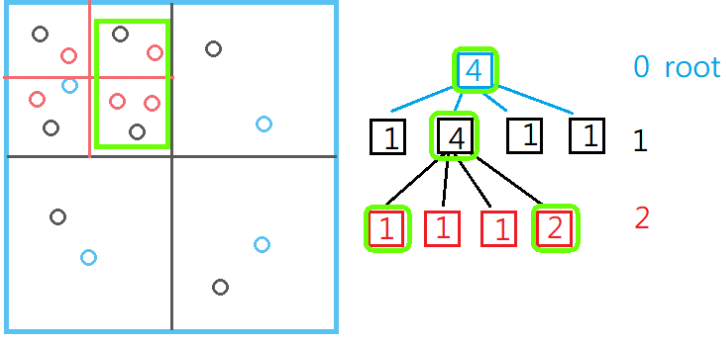
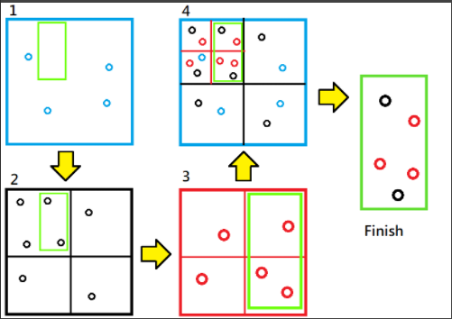
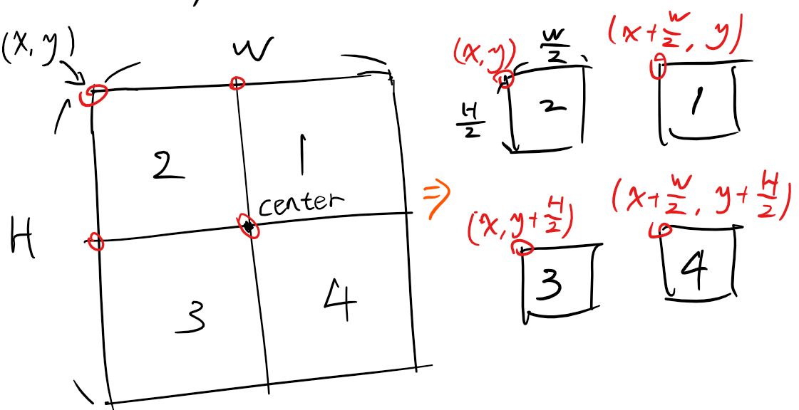

# 碰撞检测相关
### 碰撞检测的流程
游戏中的碰撞检测可以分成两个阶段BroadPhase阶段与NarrowPhase阶段：
* BroadPhase使用某种Bounding Volume来表示刚体的碰撞信息，然后用空间划分的方式保存这些Bounding Volume，可以在较短时间内筛选出可能碰撞的刚体对
* NarrowPhase此阶段是真正进行碰撞检测的阶段

### BroadPhase
#### Bounding Volume
进行BroadPhase阶段之前，先定义一种Bounding Volume，常见的有AABB，OBB，Circle/Sphere

##### AABB
AABB代表的是**轴对齐碰撞箱**（Axis-aligned Bounding Box），是指与场景基础坐标轴对齐的碰撞盒，与坐标轴对齐意味着这个长方形没有经过旋转并且它的边线和场景基础坐标轴平行。这些碰撞盒总是和场景坐标轴平行，所有计算起来比较简单。
###### AABB的表示方式
一般使用最大点与最小点来表示
###### AABB之间的碰撞检测
对于AABB之间来计算两物体是否发生碰撞只需要：对于每个轴都检测两个物体的边界是否在此轴向上有重叠，如果水平X轴上与垂直Y轴上有重叠那么可以判定为碰撞。

###### AABB 圆碰撞检测
圆与AABB的碰撞检测的关键点在于：在AABB上选择距离圆最近的一个点，如果圆心到这一点的距离小于它的半径，那么判定为碰撞。

* 首先获取球心到AABB中心点之间的矢量D
* 然后可以知道，AABB边缘上的点距离AABB的矢量一定是在： (clamp(-height/2, height/2) , clamp(-width/2, width/2)) 范围内，对矢量D进行clamp，用AABB中心加上clamp的结果就得到了距离圆最近的点P
* 通过圆心与点P可以计算出距离圆最近的矢量，然后与圆的半径对比就能判断是否碰撞

##### OBB
OBB是方向包围盒（Oriented Bounding Box）,方向包围盒类似于AABB，但是具有方向性可以旋转。
###### OBB的表示方式
一个中心点，包围盒的各轴单位矢量(2D则只需要两个，3D需要3个轴向)，以及半长，半宽，半高。
###### OBB碰撞计算
基于分离轴定律，即通过判断任意两个矩形在『任意角度下的投影是否均存在重叠』来判断是否发生碰撞，若在某一角度光源下，两物体的投影存在间隙，则为不碰撞，否则为发生碰撞
例如任意选一个方向进行投影

* 可以获得两个OBB中心连线在该方向上的投影AB porj，
* 然后依次获得OBB的半长，半宽在该方向上的投影xVt proj与yVt proj，相加可以的到OBB在该方向上的投影Vt proj
* 将两个OBB的Vt proj的长度相加：
 AB proj > sum(Vt proj) 证明矩阵相离
 AB proj = sum(Vt proj) 证明矩阵相切
 AB proj < sum(Vt proj) 证明矩阵相交

因为矩阵对边平行，所以只要判断四条对称轴上的投影即可（这也可以扩展到任意多边形）
要计算两个OBB是否发生碰撞，只需要计算他们在每个投影轴上是否有重叠，如果有重叠则判定为碰撞(投影轴来自多边形各自的垂线)

#### 空间分割
##### Grid

##### Bounding Volume Hierarchical (BVH)

##### Binary Space Partitioning (BSP)

##### Octree 八叉树

##### Quadtree 四叉树
四叉树是一种划分2D区域的树形数据结构，能够提前筛选出不可能碰撞的区域，从而加速场景中的碰撞检测
其基本思想分为两步：
插入：
* 对于每一个碰撞体尝试加入当前区域，如果当前区域所容纳的数量达到上限，则新划分四个区域，然后继续尝试加入区域中

搜索：
* 首先与根节点进行检测，判断是否与区域有交集，如果有交集检测交集区域是否有物体，并加入输出列表中
* 然后判断当前区域是否有子区域，如果有子区域则再对子区域进行检测
* 直到当前区域没有子区域后，返回输出列表

例如一个搜索例子：

大致流程如下

* 首先于蓝色的根区域进行检测，并没有发现在区域内的物体
* 对蓝色区域的四个子区域进行检测，发现只与左上方的区域相交，所以排除掉其他3个区域，同时在当前区域发现两个物体在检测范围内
* 再检测左上黑框的子区域，发现与右上，右下方相交，并且在区域中有3个物体，红色框没有子区域搜索结束

###### 四叉树的插入
插入的大致顺序：
* 如果当前点不属于A区域(初始区域)，则直接结束
* 如果该点属于A区域且，A区域的容量还足够，则直接加入A区域
* 如果A区域的容量不够，则将A区域划分为4个子区域，并将该物体加入离得最近的子区域中

子区域的划分如下：


插入过程伪代码：
```
class Object
{
    Object(x, y)
    {
        this.x = x;
        this.y = y;
    }
}

class Quad
{
    Quad(x, y, z, w)
    {
        this.x = x;
        this.y = x;
        this.w = x;
        this.h = x;
    }
}
```
```
class QuadTree
{
    QuadTree(quad, level)
    {
        // 当前最大容量
        this.MAX_OBJECT = 4;
        // 最大深度
        this.MAX_LEVEL = 5;
        // 物体集合
        this.objs = [];
        // 子区域
        this.areas = [];
        // 容器范围
        this.quad = quad;
    }

    insert(object)
    {
        if(!物体是否在区域内(this.quad, object))
            return false;
        // 如果当前区域的容量没达到上限时，则直接插入
        if(this.objs.length < this.MAX_OBJECT)
        {
            this.objs.Add(object);
            return true;
        }
        // 如果容量达到上限，并且没有子区域，分裂出子区域
        if(this.areas.length<= 0)
            分裂出子区域;
        foreach(var area in this.areas)
        {
           // 尝试给子区域添加物体
           if(area.insert(object))
               return true;
        }
    }
}
```
###### 四叉树的搜索
搜索的大致流程：
* 如果搜索的范围与当前区域相交，检查该区域有多少物体包含在搜索范围内，加入列表中
* 如果该区域有子区域，继续搜索子区域中多少物体在搜索范围中
* 直到没有子区域的时候，返回列表
搜索伪代码：
```
query（range, found）
{
    // 不在搜素范围内直接返回
    if(!物体是否在区域内(this.quad, range))
        return;
    // 如果搜索范围与当前区域相交，检查多少物体在搜索范围内
    foreach(var obj in this.objs)
    {
        if(物体是否在区域内(obj, range))
        {
            found.Add(obj);
        }
    }
    // 如果有子区域，则对子区域进行搜索
    if(this.areas.length != 0)
    {
        foreach(var area in this.areas)
        {
            area.query(range, found);
        }
    }
    return found;
}
```
