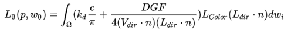

# 人物渲染笔记
todo:待完善，先记录自己实现时候的要点
### 要点归纳
首先直接光照部分基于类似PBR的思路

#### 直接漫反射
直接漫反射部分首先计算出kd，然后为了对皮肤进行一个SSS材质的模拟，采样一张LUT图，然后通过skinMask对皮肤部分漫反射以及其他部分漫反射进行一个lerp

#### 直接镜面反射
主要就是计算出D,G,F项，然后根据视觉效果对公式参数进行一些魔改

#### 间接漫反射
球谐函数

#### 间接镜面高光
IBL，texCUBElod(_CubeMap, float4(reflectDir, mipMapLevel));其中mipMaplevel由roughness计算出来