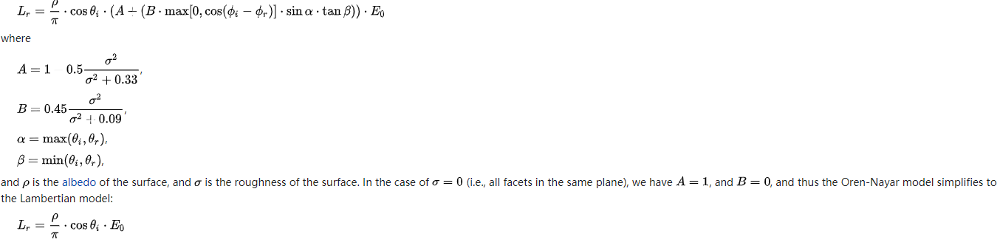
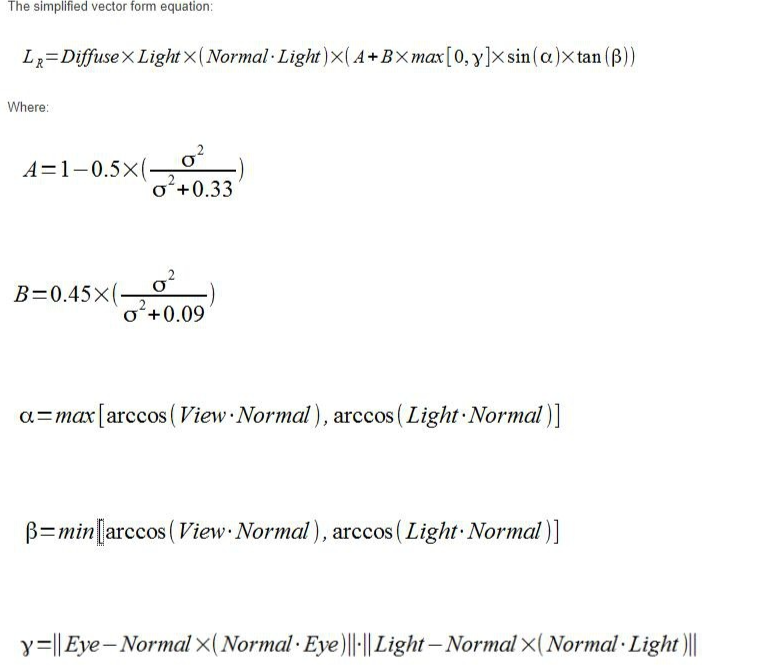
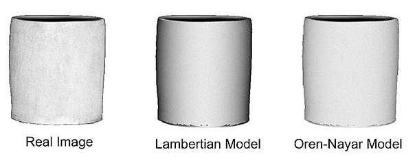

# 光照模型
#### 光照模型的组成
在我的理解中游戏中的光照基本可以由几个部分组成：直接漫反射+直接镜面反射+间接漫反射+间接镜面反射

##### 直接漫反射
###### **Lambert**
公式：diffuseColor = saturate(dot(N, L)) * _Color
与视角方向无关，从不同的方向观察不会改变渲染结果

###### **Half Lambert**
公式：diffuseColor = pow(dot(N, L) * 0.5 + 0.5, 2) * _Color
V社提出的一种改进版的Lambert算法，用于提亮暗部

###### **DiffuseWarp**
公式: diffuseColor = pow(dot(N, L) * _WrapValue + (1 - _WrapValue), 2) * _Color
_WarpValue的值范围在[0.5, 1]之间

###### **Banded Lighting**
公式:
float NdotL = saturate(dot(N, L));
float bandedStep = 6;
float bandedNL = floor(NdotL * bandedStep)/bandedStep;
float3 diffuseColor = bandedNL * _Color;

实际上就是对NdotL进行离散化梯度处理，与卡通渲染的色块分离原理类似，还可以通过离散化的NdotL对颜色进行lerp处理，形成颜色渐变效果例如：
float3 diffuseColor1 = lerp(_ColorA, _ColorB, bandedNL);
float3 diffuseColor2 = lerp(_ColorB, _ColorC, bandedNL);
float3 diffuseColor = lerp(diffuseColor1, diffuseColor2, bandedNL);

###### **Oren-Nayar Lighting**
公式:

更直观一些：

float NdotL = saturate(dot(N, L));
float NdotV = saturate(dot(N, V));
flaot roughness2 = roughness * roughness;
float A = 1 - 0.5 * (roughness2 / (roughness2 + 0.33));
float B = 0.45 * (roughness2 / (roughness2 + 0.09));
float arccosNV = acos(NdotV);
float arccosNL = acos(NdotL);
float alpha = max(arccosNV, arccosNL);
float beta = min(arccosNV, arccosNL);
float gamma = length(V - N * NdotV) * length(L - N * NdotL);
float orenNayer = NdotL * (A + B * max(0, gamma) * sin(aipha) * tan(beta));
float diffuseColor = orenNayer * _Color;

该模型用来描述光在粗糙表面的反射情况，引入了粗糙度的概念(https://en.wikipedia.org/wiki/Oren%E2%80%93Nayar_reflectance_model)

###### PBR中的diffuse项
todo

##### 直接镜面反射
###### **Phong**
公式：
float3 reflectDir = reflect(-L, N);
float VdotR = saturate(dot(reflectDir, V));
float3 specularColor = pow(VdotR, _SpecularPowValue) *_SpecularScaleValue * _Color;
利用光线方向与法线方向计算出反射向量的方向，通过反射向量与视线方向的点乘模拟出高光效果

###### **Blin-Phong**
公式：
float3 halfDir = normalize(V + L);
float NdotH = saturate(N, halfDir);
float3 specularColor = pow(NdotH, _SpecularPowValue) *_SpecularScaleValue * _Color;
对Phong模型的修改版，引入半角向量的概念来替代反射向量，与法线进行点乘，再通过pow来模拟高光效果，得到的结果相比Phong模型来说，更加光滑一些

###### **Anisotropic Lighting**
公式：
todo
各向异性高光

###### **Back Light**
公式：
todo
背光投射效果

###### PBR中的Specular项
todo

##### 间接漫反射
球谐光照

##### 间接镜面反射
IBL

