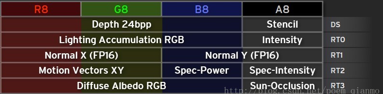
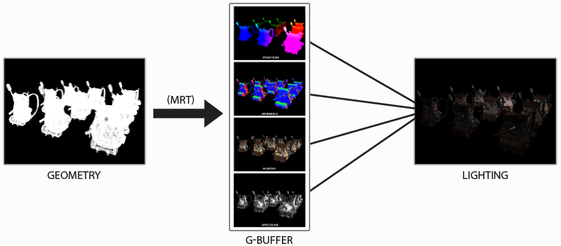
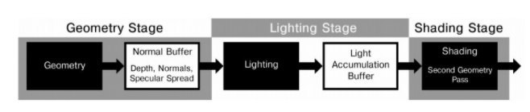

# 延迟渲染

### 延迟渲染与前向渲染
#### **前向渲染(Forward Rendering)**
传统的前向渲染（Forward Rendering）的原理是，对每个物体，经过每个光源的渲染后输出，然后再对下一个物体进行渲染，所以在一个有 n个物体与m盏灯的场景中，渲染的复杂度就是O(m*n)，通过unity的FrameDebug我们可以清晰的看到这个过程，这也是前向渲染的缺点，光照计算与场景复杂度和光源个数有很大关系。
特性：
*  前向渲染先执行着色，再执行深度测试
*  前向渲染的渲染复杂度为O(m*n)
*  光源数量对计算复杂度的影响巨大，适合光源比较少的场景

#### **延迟渲染(Deferred Rendering)**
延迟渲染(Deferred Rendering)就是为了解决该问题，延迟渲染的思路是：现将所有物体的几何信息等数据绘制在屏幕空间的缓冲G-Buffer中，然后再逐光源对该缓冲进行着色，所以渲染的复杂度为O(m + n)
简单来说，延迟渲染主要有两步组成：
* 几何处理阶段：将所有物体的几何/颜色数据例如法线，位置等信息储存到G-Buffer中
* 光照阶段：逐光源计算，对于每一个光源与从G-Buffer中取得的数据进行光照计算
特性：
* 先执行深度测试，再进行着色计算
* 渲染复杂度为O(m+n)
* 场景的渲染复杂度不会随光源数量改变发生巨大变化

### 几何缓冲区G-Buffer
G-Buffer(Geometric Buffer)几何缓冲区，主要用来储存每个像素对应的位置，法线，漫反射颜色等材质参数，根据这些信息在二维空间中对每个像素进行光照处理

#### MRT技术(Multiple Render Targets)
上面说到，延迟渲染需要两步，先输出每个像素对应的位置，法线等信息，然后再逐光源进行光照计算。这时候需要用到多渲染目标，将片元着色器中计算的不同数据结果输出到不同的RGBA纹理中，例如我们构建一个多渲染目标的结构，作为片元着色器的输出：
struct pixelOutput
{
    float4 color1 : COLOR0;
    float4 color2 : COLOR1;
}
然后对应在我们的片元着色器中就变成
pixelOutput frag(v2f i)
{
    pixelOutput o;
    ...
    o.color1 = float4(1, 1, 1, 1);
    o.color2 = float4(0, 1, 1, 1);
}
这样就通过一个pass输出多个渲染目标，同时这时候我们需要申请对应数量的RenderTexture作为输出的Target，在例子中我们需要2个RT，以及额外的一个RT，DepthTexture作为接收Depth的Target，通过SetRenderTarget函数可以设置我们的渲染目标，然后就是将这些RT作为参数传入需要进行光照计算的shader中，之后在计算光照的shader中，我们只需要对G-Buffer进行采样就能获得需要的数据，与光源进行计算。

### 延迟渲染缺点
*  内存开销大
*  读写G-Buffer的内存带宽是性能瓶颈
*  对渲染透明物体时存在问题，需要结合前向渲染进行渲染
*  对多重采样抗锯齿MSAA不友好，因为开启了MRT
*  由于Deferred Shading的Deferred阶段是在完全基于G-Buffer的屏幕空间进行，这也导致了物体材质信息的缺失，这样在处理多变的渲染风格时就需要额外的操作。

### 延迟渲染的改进
主要有两种方案延迟光照(Deferred Lighting)与分块延迟渲染Tile-BaseDeferred Rending
#### 延迟光照Deferred Lighting
具体思路分一下几步
1. 渲染场景中的不透明物体，将法线向量n与镜面扩展因子写入缓冲区，这个缓冲区类似G-Buffer但是包含的信息更少，而且适用于单个输出颜色缓冲区，不需要MRT
2. 渲染光照，计算漫反射和镜面反射，将结果写入不同的颜色缓冲区中(MRT)
3. 对场景中的不透明物体进行第二次渲染，从纹理中读取漫反射与镜面反射值，与第二步中的光照值进行计算，将最终的结果写入颜色缓冲区中，然后处理环境光
4. 使用前向渲染的方法渲染透物体

相对于传统的 Deferred Render，使用 Light Pre-Pass 可以对每个不同的几何体使用不同 的 shader 进行渲染，所以每个物体的 material properties 将有更多变化。

#### 分块延迟渲染Tile-BasedDeferred Rendering
延迟渲染的瓶颈在于读写 G-buffer，在大量光源下，具体瓶颈将位于每个光源对 G-buffer的读取及与颜色缓冲区（color buffer）混合。每个光源，即使它们的影响范围在屏幕空间上有重疉，因为每个光源是在不同的绘制中进行，所以会重复读取G-buffer中相同位置的数据，计算后以相加混合方式写入颜色缓冲。光源越多，内存带宽用量越大。
分块延迟渲染的主要思想则是把屏幕分拆成细小的栅格，然后，计算每个分块会受到哪些光源影响，把那些光源的索引储存在分块的光源列表里。最后，逐个分块进行着色，对每像素读取 G-buffer 和光源列表及相关的光源信息。因此，G-buffer的数据只会被读取1次且仅1次，写入 color buffer也是1次且仅1次，大幅降低内存带宽用量。

#### 延迟渲染与延迟光照
这两个概念挺容易搞混淆的，这里区别一下：
* Deferred Shading需要更大的G-Buffer来完成对Deferred阶段的前期准备，而且一般需要硬件有MRT的支持，可以说是硬件要求更高。
* Deferred Lighting需要两个几何体元的绘制过程来来完成整个渲染操作：G-Pass与Shading pass。这个既是劣势也是优势：由于Deferred Shading中的Deferred阶段是在完全基于G-Buffer的屏幕空间进行，这也导致了物体材质信息的缺失，这样在处理多变的渲染风格时就需要额外的操作；而Deferred Lighting却可以在Shading阶段得到物体的材质信息进而使这一问题的处理变得较简单。
* 两种方法都是只能对不透明物体进行渲染，而对半透明与透明物体则需要额外的前向渲染来完成