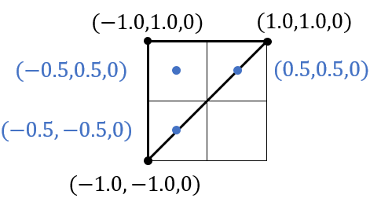

# 渲染管线基础知识
### 渲染管线概述
渲染管线RenderPipeline是指以摄像机为观察视角生成2D图像的一整个流程。常见的渲染管线整个流程大致有以下几个阶段：
- 输入装配阶段
- **顶点着色器阶段**(Vertex Shader)
- 曲面细分阶段(Tessellator Shader)
- 几何着色器阶段(Geometry Shader)
- 光栅化阶段(Rasterizer)
- **片元着色器阶段**(Fragment/Pixel Shader)
- 输出合并阶段(Output Merger)
其中最常用的可编程着色器部分就是我们熟悉的顶点、片元着色器阶段了。

#### 输入装配阶段
这个阶段是将渲染管线所需要的一些信息例如顶点数据，从CPU端传输到GPU端的过程，同时会告诉GPU端我们该用什么样的形式组织我们的顶点(**图元拓扑**)，以及告诉顶点着色器如何从传入的数据中取得对应的数据(**顶点布局**)。

#### 顶点着色器阶段
完成输入装配阶段后，顶点数据被送到顶点着色器中，顶点着色器会通过对应的语义，从显存中取得需要的数据，例如顶点的位置信息，uv信息，法线信息等。顶点着色器中，我们会将顶点位置通过一系列的矩阵**变换**转移到裁剪空间，并传输给下一阶段。通常我们会将法线，切线等数据转移到世界空间中，传输给下一阶段使用。
我们通过MVP矩阵将顶点转移到齐次裁剪空间当中，我们在齐次裁剪空间中进行裁剪，裁剪后通过透视除法将顶点规范在归一化设备坐标空间(NDC)

#### 光栅化阶段
光栅化阶段首先会对输入的顶点进行**视口变换**，然后可以通过顶点的x,y坐标映射到屏幕上，确定当前图元会出现在待绘制的哪些像素位置上，根据图元的顶点信息，利用**透视校正插值法**来计算出像素片段的位置，颜色等信息。
对于三角形来说，顶点的顺序有不同的含义。默认情况下，三角形顶点绕顺时针排布时会被认为是朝向摄像机的面，逆时针排布时会被认为是背向摄像机的面，对于背向摄像机的面三角形会被剔除，这种做法叫做**背面消隐**。
在进行光栅化的时候，每个像素都是以它的中点位置进行插值计算的。如下图，可以看到以黑色顶点构成的三角形，在光栅化的时候会被插值计算成蓝色的顶点

#### 片元着色器阶段
片元着色器会对每一个像素/片元进行计算，并输出到下一阶段。我们可以在片元着色器中进行复杂光照，阴影等效果的计算。

#### 输出合并阶段
通过片元着色器计算后的结果会被送至输出合并阶段中，在这个阶段会进行一系列判断(alpha测试，模板测试，深度测试，alpha blending)，最终决定输出到后台缓冲中。

#### 易混淆点
##### Clip Space
Clip Space是顶点乘上MVP矩阵转换后所存在的空间，顶点着色器的输出就是在Clip Space中，随后，GPU会在Clip Space上做裁剪，然后GPU再通过透视除法将顶点转换到NDC空间中

##### NDC空间
透视除法中将顶点的4个分量都除以w分量就将顶点从Clip Space转换到NDC之中，NDC是一个长宽高都是[-1, 1]之间的一个立方体。如果一个NDC空间中的顶点坐标是（x, y, z, 1）那么反推在Clip Space中的位置就是（xw, yw, zw, w）其中w的值是顶点在View Space中的z值

##### 片元着色器的输入
顶点着色器的输出是裁剪空间Clip Space，片元着色器的输入是屏幕空间Screen Space，也就是说，GPU在进行透视除法将顶点从Clip Space转移到NDC后，在光栅化阶段会进行视口映射，转换到Screen Space中，输入给片元着色器中