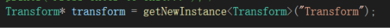
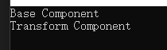

# C++实现反射
总所周知，C++本身并不带有反射功能，所以要实现根据字符串动态创建对象类型的反射功能的话，需要自己实现
### 反射的原理
这里不去扯那些定义，简单直观的来说比如我们有个类名"Transform"，我们希望动态的去生成这个类型，即类似unity组件模式的方式getComponemt("Transform")就能够获得这个类型的对象。
那么思考一下，我们就需要有一个类名——对应类型的构造函数的一个映射关系，我们能够通过提供类名，查询对应的函数去生成这个类型对象。最直观的来说如下面代码：
```
template<typename T>
T* getNewInstance(const std::string& className) {
  if (className == "Transform") {
    return new Transform();
  }
  else if (className == "Rigidbody") {
    return new Rigidbody();
  }
}
```
但是要是想上面一样的写法会导致这个函数无线膨胀，难以管理，我们可以使用工厂模式来修改一下这种写法：
首先需要一个可以被反射的类的基类ReflectObjet以及对应的对象工厂
```
class ObjectFactory{
  virtual ReflectObject* newInstance() = 0;
}
class ObjectFactory_Transform : public ObjectFactory{
  ReflectObject* newInstance(){
    return new Transform();
  };
}
```
然后我们需要一个map，将类名"Transform" 与 ObjectFactory_Transform 联系起来，所以这里我们定义一个反射器 Reflector
```
class Reflector
{
public:
    Reflector();
    ~Reflector();
    void Register(const std::string& className, ObjectFactory *of);
    ReflectObject* getNewInstance(const std::string& className);
private:
    std::map<std::string, ObjectFactory*> registerMap;
};
```
然后就是需要注册反射类，步骤主要是一下几部分，以Transform类为例子
* 定义Transform类(略)
* 定义Transform的工厂类ObjectFactory_Transform(如上)
* 创建Transform的工厂类实例并注册到反射器中
```
reflector.Register("Transform", new ObjectFactory_Transform());
```
可见每当我们添加一个需要反射的类时，都需要经过上面的布置，第二个与第三个步骤我们可以创建一个宏指令来简化我们的代码
```
#define REGISTERCLASS(name)\
class ObjectFactory_##name : public ObjectFactory{\
public:\
	ObjectFactory_##name(){}\
	virtual ~ObjectFactory_##name(){}\
	ReflectObject* newInstance() {\
		return new name(); \
	}\
}; \
class Register_##name{\
public:\
	Register_##name(){\
		reflector().Register(#name, new ObjectFactory_##name()); \
	}\
};\
Register_##name register_##name;
```
这样就只需要在我们自定义的反射类的开头添上这个宏指令便能够注册反射类
```
REGISTERCLASS(Transform);
Transform::Transform()
{
	std::cout << "Transform Component" << std::endl;
}

Transform::~Transform()
{
}
```
当我们需要创建类型的时候，就只需要在registerMap中根据类名去查找对应的工厂实例，然后调用newInstance()方法便能动态生成ReflectObject类型然后还需要将其从ReflectOject类型转换成需要的类型，将其封装一下:
```
ReflectObject* Reflector::GetNewInstance(const std::string& className)
{
	std::map<std::string, ObjectFactory*>::iterator it = registerMap.find(className);
	if (it != registerMap.end()) {
		ObjectFactory* f = it->second;
		return f->newInstance();
	}
	return nullptr;
}

template<typename T>
T* getNewInstance(const std::string& className) {
	return dynamic_cast<T*>(reflector().GetNewInstance(className));
}
```

### 测试结果




